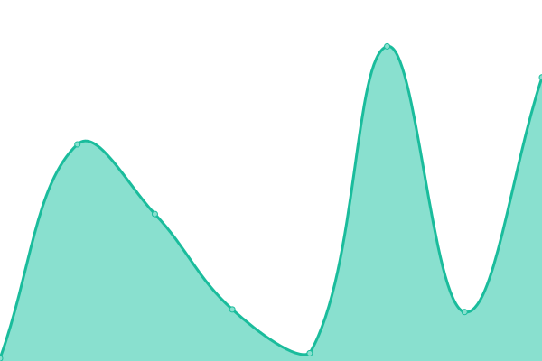
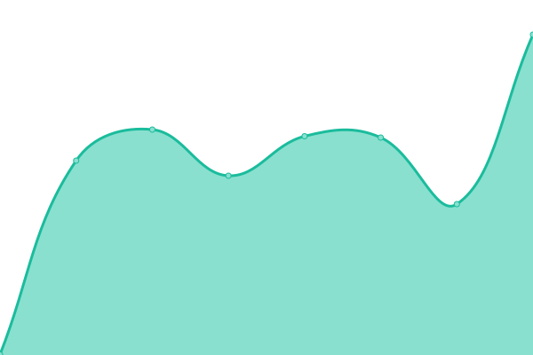

# [📈 Live Status](https://status.optimade.org): <!--live status--> **🟩 All systems operational**

This repository contains the open-source uptime monitor and status page for [Open Databases Integration for Materials Design](https://www.optimade.org), powered by [Upptime](https://github.com/upptime/upptime).

With [Upptime](https://upptime.js.org), you can get your own unlimited and free uptime monitor and status page, powered entirely by a GitHub repository. We use [Issues](https://github.com/Materials-Consortia/status/issues) as incident reports, [Actions](https://github.com/Materials-Consortia/status/actions) as uptime monitors, and [Pages](https://status.optimade.org) for the status page.

<!--start: status pages-->
<!-- This summary is generated by Upptime (https://github.com/upptime/upptime) -->
<!-- Do not edit this manually, your changes will be overwritten -->
<!-- prettier-ignore -->
| URL | Status | History | Response Time | Uptime |
| --- | ------ | ------- | ------------- | ------ |
|  [Homepage](https://www.optimade.org) | 🟩 Up | [homepage.yml](https://github.com/Materials-Consortia/status/commits/HEAD/history/homepage.yml) | 

 886ms
     
 | 

<a href="https://status.optimade.org/history/homepage">100.00%</a>
    

|  [Providers dashboard](https://www.optimade.org/providers-dashboard/) | 🟩 Up | [providers-dashboard.yml](https://github.com/Materials-Consortia/status/commits/HEAD/history/providers-dashboard.yml) | 

 45ms
     
 | 

<a href="https://status.optimade.org/history/providers-dashboard">100.00%</a>
    

|  [Providers index meta-database](https://providers.optimade.org/) | 🟩 Up | [providers-index-meta-database.yml](https://github.com/Materials-Consortia/status/commits/HEAD/history/providers-index-meta-database.yml) | 

 633ms
     
 | 

<a href="https://status.optimade.org/history/providers-index-meta-database">100.00%</a>
    

|  [Schemas](https://schemas.optimade.org/) | 🟩 Up | [schemas.yml](https://github.com/Materials-Consortia/status/commits/HEAD/history/schemas.yml) | 

 454ms
     
 | 

<a href="https://status.optimade.org/history/schemas">100.00%</a>
    

<!--end: status pages-->

[**Visit our status website →**](https://status.optimade.org)

## 📄 License

- Powered by: [Upptime](https://github.com/upptime/upptime)
- Code: [MIT](./LICENSE) © [Open Databases Integration for Materials Design](https://www.optimade.org)
- Data in the `./history` directory: [Open Database License](https://opendatacommons.org/licenses/odbl/1-0/)
